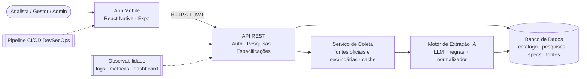

# 1. Backlog do Produto

Backlog no padrão Scrum (Épico › Feature › Product Backlog Item), alinhado à arquitetura definida na sprint anterior (TOGAF/ArchiMate).

## Arquitetura de referência

## Épicos × componentes da arquitetura

| Épico | Componente(s) | Features | PBIs | Pontos |
|---|---|---|---|---|
| **EP-01** Fundação da Plataforma e Catálogo de Atributos | Banco de Dados · Pipeline CI | 2 | 5 | 21 |
| **EP-02** Segurança e Gestão de Acesso | API REST (Auth/JWT) · Pipeline DevSecOps | 2 | 4 | 21 |
| **EP-03** Pesquisa de Veículos Concorrentes (Entrada) | API REST · App Mobile | 2 | 4 | 16 |
| **EP-04** Coleta e Extração Inteligente de Dados Técnicos | Serviço de Coleta · Motor de Extração IA | 2 | 6 | 39 |
| **EP-05** Saída Padronizada de Especificações Técnicas | API REST · Banco de Dados | 2 | 5 | 26 |
| **EP-06** Aplicativo Mobile | App Mobile | 2 | 6 | 24 |
| **EP-07** Qualidade, Validação e Observabilidade | Testes automatizados · Observabilidade | 2 | 5 | 21 |
| **EP-08** Entrega Final e Pitch | Documentação · Entrega | 1 | 2 | 8 |

**Total:** 8 épicos · 15 features · 37 PBIs · 176 pontos

## Estrutura hierárquica

### EP-01 · Fundação da Plataforma e Catálogo de Atributos

Estabelecer a arquitetura (camadas: App Mobile, API Gateway/Backend, Serviço de Coleta, Motor de Extração IA, Banco de Dados), o ambiente de desenvolvimento, o pipeline CI e o catálogo padrão de atributos técnicos que garante que toda saída tenha o mesmo formato.

- **FT-01 · Arquitetura e Ambiente de Desenvolvimento**
  - PBI-01 · Definir arquitetura da solução e diagrama de componentes · `Must` · 3 pts · Sprint 1
  - PBI-02 · Configurar repositório, estratégia de branches e pipeline CI · `Must` · 5 pts · Sprint 1
  - PBI-03 · Modelar banco de dados (veículos, atributos, pesquisas, especificações, fontes) · `Must` · 5 pts · Sprint 1
- **FT-02 · Catálogo Padrão de Atributos Técnicos**
  - PBI-04 · Cadastrar catálogo padrão de atributos técnicos com unidade e categoria · `Must` · 5 pts · Sprint 1
  - PBI-05 · Mapear sinônimos de atributos (ex.: 'cv', 'potência', 'hp') · `Should` · 3 pts · Sprint 1

### EP-02 · Segurança e Gestão de Acesso

Garantir que apenas usuários autenticados e autorizados utilizem a ferramenta, com perfis distintos, API protegida e segurança integrada ao pipeline (DevSecOps).

- **FT-03 · Autenticação e Perfis de Acesso**
  - PBI-11 · Cadastro e login com geração e validação de JWT · `Must` · 8 pts · Sprint 2
  - PBI-12 · Controle de acesso por perfil (Analista, Gestor, Administrador) · `Must` · 5 pts · Sprint 2
- **FT-04 · Proteção da API e DevSecOps**
  - PBI-21 · Hardening da API: rate limit, validação de entrada e padronização de erros · `Must` · 3 pts · Sprint 3
  - PBI-22 · Pipeline DevSecOps (SAST, SCA, secret scanning e container scan) · `Should` · 5 pts · Sprint 3

### EP-03 · Pesquisa de Veículos Concorrentes (Entrada)

Permitir que o analista informe, a partir de uma entrada simples, Marca, Modelo e Versão do veículo e defina livremente a lista de equipamentos/atributos técnicos que deseja pesquisar.

- **FT-05 · Identificação do Veículo**
  - PBI-06 · Informar Marca, Modelo e Versão para iniciar a pesquisa · `Must` · 5 pts · Sprint 1
  - PBI-07 · Sugerir (autocompletar) marcas, modelos e versões · `Should` · 3 pts · Sprint 1
- **FT-06 · Lista Livre de Atributos**
  - PBI-08 · Definir livremente a lista de atributos a pesquisar · `Must` · 5 pts · Sprint 1
  - PBI-36 · Salvar modelos (templates) de listas de atributos · `Could` · 3 pts · Backlog futuro

### EP-04 · Coleta e Extração Inteligente de Dados Técnicos

Coletar dados técnicos da concorrência em fontes oficiais e secundárias e extrair as especificações com um motor híbrido (IA/LLM + regras), normalizando unidades.

- **FT-07 · Coleta de Fontes de Dados**
  - PBI-13 · Conector de coleta em fichas técnicas oficiais das montadoras · `Must` · 8 pts · Sprint 2
  - PBI-14 · Cache de fontes coletadas com data e URL · `Should` · 3 pts · Sprint 2
  - PBI-28 · Conector para fontes secundárias (portais automotivos especializados) · `Should` · 5 pts · Sprint 4
- **FT-08 · Extração de Especificações com IA**
  - PBI-15 · Extrair especificações do conteúdo coletado com motor híbrido (LLM + regras) · `Must` · 13 pts · Sprint 2
  - PBI-18 · Normalizar unidades e formatos das especificações · `Must` · 5 pts · Sprint 3
  - PBI-29 · Indicador de confiança e rastreabilidade de fonte por atributo · `Should` · 5 pts · Sprint 4

### EP-05 · Saída Padronizada de Especificações Técnicas

Gerar uma lista de especificações técnicas sempre no mesmo formato, independente do veículo, com campos claros, organizados e comparáveis, explicitando dados inexistentes.

- **FT-09 · Lista Padronizada de Especificações**
  - PBI-19 · Gerar lista de especificações em formato único (schema padronizado) · `Must` · 8 pts · Sprint 3
  - PBI-20 · Explicitar 'Não disponível' quando a informação não existir · `Must` · 2 pts · Sprint 3
- **FT-10 · Comparação, Exportação e Histórico**
  - PBI-30 · Comparar dois ou mais veículos lado a lado · `Should` · 8 pts · Sprint 4
  - PBI-32 · Exportar especificações em CSV, XLSX e PDF · `Should` · 5 pts · Sprint 4
  - PBI-33 · Histórico de pesquisas do usuário · `Could` · 3 pts · Sprint 4

### EP-06 · Aplicativo Mobile

Aplicativo React Native (Expo) com identidade visual consistente, que permite pesquisar, visualizar e comparar especificações, publicado como APK.

- **FT-11 · Telas do Aplicativo**
  - PBI-09 · Criar design system do app (cores, tipografia, componentes) · `Must` · 3 pts · Sprint 1
  - PBI-16 · Telas de login e cadastro no app · `Must` · 3 pts · Sprint 2
  - PBI-17 · Tela de nova pesquisa (veículo + lista de atributos) · `Must` · 5 pts · Sprint 2
  - PBI-25 · Tela de resultado com a lista padronizada de especificações · `Must` · 5 pts · Sprint 3
  - PBI-31 · Tela de comparação de veículos no app · `Should` · 5 pts · Sprint 4
- **FT-12 · Publicação do Aplicativo**
  - PBI-26 · Gerar build APK via Expo EAS Build · `Must` · 3 pts · Sprint 3

### EP-07 · Qualidade, Validação e Observabilidade

Assegurar que a solução está operando corretamente, usando a Ford Ranger Raptor como caso de validação oficial, testes automatizados e monitoramento.

- **FT-13 · Validação com Ford Ranger Raptor**
  - PBI-10 · Criar gabarito de referência (massa de teste) da Ford Ranger Raptor · `Must` · 3 pts · Sprint 1
  - PBI-24 · Teste de aceitação automatizado com a Ford Ranger Raptor · `Must` · 5 pts · Sprint 3
- **FT-14 · Testes Automatizados e Observabilidade**
  - PBI-23 · Testes automatizados da API (sucesso, erro e acesso não autorizado) · `Must` · 5 pts · Sprint 3
  - PBI-34 · Logs estruturados, métricas e dashboard de monitoramento · `Should` · 5 pts · Sprint 4
  - PBI-37 · Monitorar custo e latência das chamadas ao modelo de IA · `Could` · 3 pts · Backlog futuro

### EP-08 · Entrega Final e Pitch

Consolidar documentação e apresentar a solução final à Ford e à FIAP em vídeo pitch/técnico de até 6 minutos.

- **FT-15 · Documentação e Apresentação Final**
  - PBI-27 · Documentação da API (OpenAPI/Swagger) e README de execução · `Must` · 3 pts · Sprint 3
  - PBI-35 · Produzir vídeo pitch/técnico da solução final (até 6 min) · `Must` · 5 pts · Sprint 4

