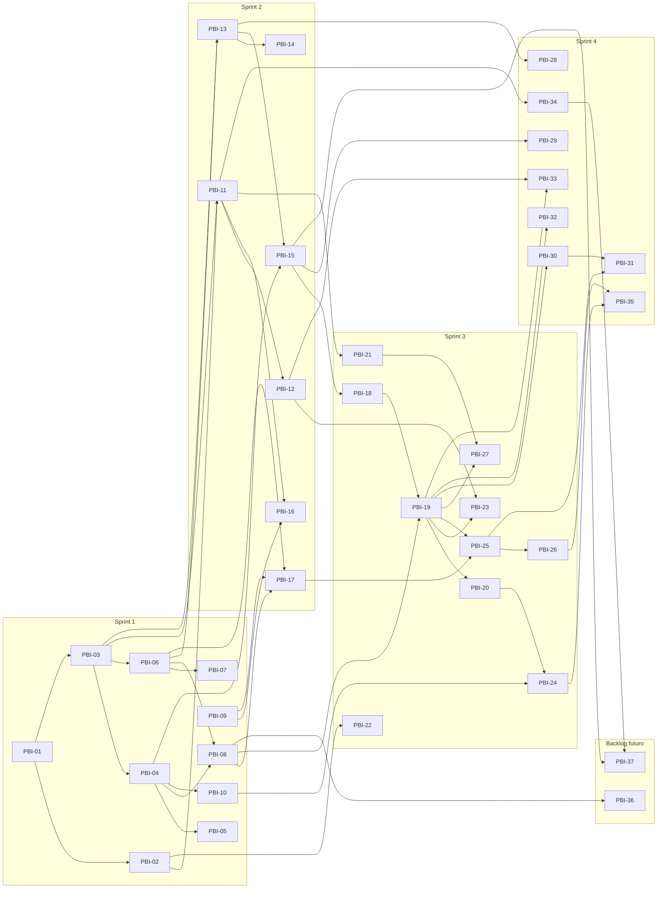

# 3. Prioridade, Esforço e Dependências

## Prioridade (MoSCoW)

| Prioridade | Significado | Valor de negócio |
|---|---|---|
| **Must** | Obrigatório (Must have) — requisito do desafio Ford, sem ele a solução não é aceita | 100 |
| **Should** | Necessário (Should have) — agrega valor relevante ao negócio, mas não bloqueia a aceitação | 50 |
| **Could** | Opcional (Could have) — melhoria desejável, entra se houver capacidade | 20 |

## Esforço (Planning Poker)

Escala de Fibonacci **1 · 2 · 3 · 5 · 8 · 13**. Referência: **3 pontos** = um endpoint simples com testes. Itens com 13 pontos são revisados para quebra antes de entrar na sprint.

| Prioridade | PBIs | Pontos |
|---|---|---|
| Must | 24 | 120 |
| Should | 10 | 47 |
| Could | 3 | 9 |

## Backlog ordenado (sequência de implementação)

| # | PBI | Título | Feature | Prioridade | Esforço | Predecessores | Sprint |
|---|---|---|---|---|---|---|---|
| 1 | PBI-01 | Definir arquitetura da solução e diagrama de componentes | FT-01 | Must | 3 | — | Sprint 1 |
| 2 | PBI-02 | Configurar repositório, estratégia de branches e pipeline CI | FT-01 | Must | 5 | PBI-01 | Sprint 1 |
| 3 | PBI-03 | Modelar banco de dados (veículos, atributos, pesquisas, especificações, fontes) | FT-01 | Must | 5 | PBI-01 | Sprint 1 |
| 4 | PBI-04 | Cadastrar catálogo padrão de atributos técnicos com unidade e categoria | FT-02 | Must | 5 | PBI-03 | Sprint 1 |
| 5 | PBI-05 | Mapear sinônimos de atributos (ex.: 'cv', 'potência', 'hp') | FT-02 | Should | 3 | PBI-04 | Sprint 1 |
| 6 | PBI-06 | Informar Marca, Modelo e Versão para iniciar a pesquisa | FT-05 | Must | 5 | PBI-03 | Sprint 1 |
| 7 | PBI-07 | Sugerir (autocompletar) marcas, modelos e versões | FT-05 | Should | 3 | PBI-06 | Sprint 1 |
| 8 | PBI-08 | Definir livremente a lista de atributos a pesquisar | FT-06 | Must | 5 | PBI-04, PBI-06 | Sprint 1 |
| 9 | PBI-09 | Criar design system do app (cores, tipografia, componentes) | FT-11 | Must | 3 | — | Sprint 1 |
| 10 | PBI-10 | Criar gabarito de referência (massa de teste) da Ford Ranger Raptor | FT-13 | Must | 3 | PBI-04 | Sprint 1 |
| 11 | PBI-11 | Cadastro e login com geração e validação de JWT | FT-03 | Must | 8 | PBI-02, PBI-03 | Sprint 2 |
| 12 | PBI-12 | Controle de acesso por perfil (Analista, Gestor, Administrador) | FT-03 | Must | 5 | PBI-11 | Sprint 2 |
| 13 | PBI-13 | Conector de coleta em fichas técnicas oficiais das montadoras | FT-07 | Must | 8 | PBI-03, PBI-06 | Sprint 2 |
| 14 | PBI-14 | Cache de fontes coletadas com data e URL | FT-07 | Should | 3 | PBI-13 | Sprint 2 |
| 15 | PBI-15 | Extrair especificações do conteúdo coletado com motor híbrido (LLM + regras) | FT-08 | Must | 13 | PBI-04, PBI-13 | Sprint 2 |
| 16 | PBI-16 | Telas de login e cadastro no app | FT-11 | Must | 3 | PBI-09, PBI-11 | Sprint 2 |
| 17 | PBI-17 | Tela de nova pesquisa (veículo + lista de atributos) | FT-11 | Must | 5 | PBI-06, PBI-08, PBI-09 | Sprint 2 |
| 18 | PBI-18 | Normalizar unidades e formatos das especificações | FT-08 | Must | 5 | PBI-15 | Sprint 3 |
| 19 | PBI-19 | Gerar lista de especificações em formato único (schema padronizado) | FT-09 | Must | 8 | PBI-08, PBI-18 | Sprint 3 |
| 20 | PBI-20 | Explicitar 'Não disponível' quando a informação não existir | FT-09 | Must | 2 | PBI-19 | Sprint 3 |
| 21 | PBI-21 | Hardening da API: rate limit, validação de entrada e padronização de erros | FT-04 | Must | 3 | PBI-11 | Sprint 3 |
| 22 | PBI-22 | Pipeline DevSecOps (SAST, SCA, secret scanning e container scan) | FT-04 | Should | 5 | PBI-02 | Sprint 3 |
| 23 | PBI-23 | Testes automatizados da API (sucesso, erro e acesso não autorizado) | FT-14 | Must | 5 | PBI-12, PBI-19 | Sprint 3 |
| 24 | PBI-24 | Teste de aceitação automatizado com a Ford Ranger Raptor | FT-13 | Must | 5 | PBI-10, PBI-20 | Sprint 3 |
| 25 | PBI-25 | Tela de resultado com a lista padronizada de especificações | FT-11 | Must | 5 | PBI-17, PBI-19 | Sprint 3 |
| 26 | PBI-26 | Gerar build APK via Expo EAS Build | FT-12 | Must | 3 | PBI-25 | Sprint 3 |
| 27 | PBI-27 | Documentação da API (OpenAPI/Swagger) e README de execução | FT-15 | Must | 3 | PBI-19, PBI-21 | Sprint 3 |
| 28 | PBI-28 | Conector para fontes secundárias (portais automotivos especializados) | FT-07 | Should | 5 | PBI-13 | Sprint 4 |
| 29 | PBI-29 | Indicador de confiança e rastreabilidade de fonte por atributo | FT-08 | Should | 5 | PBI-15 | Sprint 4 |
| 30 | PBI-30 | Comparar dois ou mais veículos lado a lado | FT-10 | Should | 8 | PBI-19 | Sprint 4 |
| 31 | PBI-31 | Tela de comparação de veículos no app | FT-11 | Should | 5 | PBI-25, PBI-30 | Sprint 4 |
| 32 | PBI-32 | Exportar especificações em CSV, XLSX e PDF | FT-10 | Should | 5 | PBI-19 | Sprint 4 |
| 33 | PBI-33 | Histórico de pesquisas do usuário | FT-10 | Could | 3 | PBI-12, PBI-19 | Sprint 4 |
| 34 | PBI-34 | Logs estruturados, métricas e dashboard de monitoramento | FT-14 | Should | 5 | PBI-11 | Sprint 4 |
| 35 | PBI-35 | Produzir vídeo pitch/técnico da solução final (até 6 min) | FT-15 | Must | 5 | PBI-24, PBI-26 | Sprint 4 |
| 36 | PBI-36 | Salvar modelos (templates) de listas de atributos | FT-06 | Could | 3 | PBI-08 | Backlog futuro |
| 37 | PBI-37 | Monitorar custo e latência das chamadas ao modelo de IA | FT-14 | Could | 3 | PBI-15, PBI-34 | Backlog futuro |

## Mapa de dependências

Links **pai › filho** (Épico › Feature › PBI) estão em [01-backlog.md](01-backlog.md). Abaixo, os links de **precedência** entre PBIs (A → B = B depende de A).

