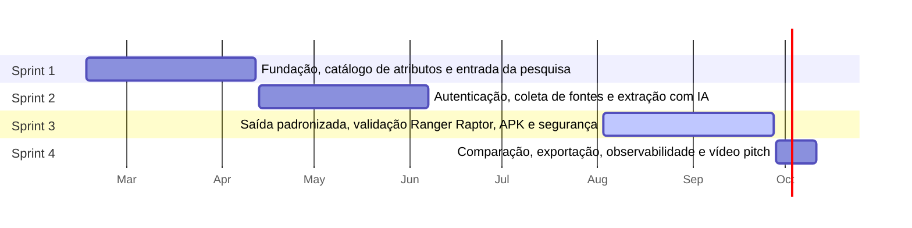

# 4. Release Plan

| Sprint | Período | Objetivo | Pontos | Status |
|---|---|---|---|---|
| **Sprint 1** | 16/02/2026 – 12/04/2026 | Fundação, catálogo de atributos e entrada da pesquisa | 40 | Concluída |
| **Sprint 2** | 13/04/2026 – 07/06/2026 | Autenticação, coleta de fontes e extração com IA | 45 | Concluída |
| **Sprint 3** | 03/08/2026 – 27/09/2026 | Saída padronizada, validação Ranger Raptor, APK e segurança | 44 | Em curso |
| **Sprint 4** | 28/09/2026 – 11/10/2026 | Comparação, exportação, observabilidade e vídeo pitch | 41 | Planejada |
| **Backlog futuro** | - – - | Itens opcionais não planejados nesta release | 6 | Não planejado |

Total planejado: **170 pontos** em 4 sprints, média de **42.5 pontos por sprint**. Itens opcionais (*Could*) que não couberam ficam no backlog futuro.

## Roadmap

## Sprint 1 · 40 pontos

**Objetivo:** Fundação, catálogo de atributos e entrada da pesquisa

| PBI | Título | Épico | Prioridade | Pontos |
|---|---|---|---|---|
| PBI-01 | Definir arquitetura da solução e diagrama de componentes | EP-01 | Must | 3 |
| PBI-02 | Configurar repositório, estratégia de branches e pipeline CI | EP-01 | Must | 5 |
| PBI-03 | Modelar banco de dados (veículos, atributos, pesquisas, especificações, fontes) | EP-01 | Must | 5 |
| PBI-04 | Cadastrar catálogo padrão de atributos técnicos com unidade e categoria | EP-01 | Must | 5 |
| PBI-05 | Mapear sinônimos de atributos (ex.: 'cv', 'potência', 'hp') | EP-01 | Should | 3 |
| PBI-06 | Informar Marca, Modelo e Versão para iniciar a pesquisa | EP-03 | Must | 5 |
| PBI-07 | Sugerir (autocompletar) marcas, modelos e versões | EP-03 | Should | 3 |
| PBI-08 | Definir livremente a lista de atributos a pesquisar | EP-03 | Must | 5 |
| PBI-09 | Criar design system do app (cores, tipografia, componentes) | EP-06 | Must | 3 |
| PBI-10 | Criar gabarito de referência (massa de teste) da Ford Ranger Raptor | EP-07 | Must | 3 |

## Sprint 2 · 45 pontos

**Objetivo:** Autenticação, coleta de fontes e extração com IA

| PBI | Título | Épico | Prioridade | Pontos |
|---|---|---|---|---|
| PBI-11 | Cadastro e login com geração e validação de JWT | EP-02 | Must | 8 |
| PBI-12 | Controle de acesso por perfil (Analista, Gestor, Administrador) | EP-02 | Must | 5 |
| PBI-13 | Conector de coleta em fichas técnicas oficiais das montadoras | EP-04 | Must | 8 |
| PBI-14 | Cache de fontes coletadas com data e URL | EP-04 | Should | 3 |
| PBI-15 | Extrair especificações do conteúdo coletado com motor híbrido (LLM + regras) | EP-04 | Must | 13 |
| PBI-16 | Telas de login e cadastro no app | EP-06 | Must | 3 |
| PBI-17 | Tela de nova pesquisa (veículo + lista de atributos) | EP-06 | Must | 5 |

## Sprint 3 · 44 pontos

**Objetivo:** Saída padronizada, validação Ranger Raptor, APK e segurança

| PBI | Título | Épico | Prioridade | Pontos |
|---|---|---|---|---|
| PBI-18 | Normalizar unidades e formatos das especificações | EP-04 | Must | 5 |
| PBI-19 | Gerar lista de especificações em formato único (schema padronizado) | EP-05 | Must | 8 |
| PBI-20 | Explicitar 'Não disponível' quando a informação não existir | EP-05 | Must | 2 |
| PBI-21 | Hardening da API: rate limit, validação de entrada e padronização de erros | EP-02 | Must | 3 |
| PBI-22 | Pipeline DevSecOps (SAST, SCA, secret scanning e container scan) | EP-02 | Should | 5 |
| PBI-23 | Testes automatizados da API (sucesso, erro e acesso não autorizado) | EP-07 | Must | 5 |
| PBI-24 | Teste de aceitação automatizado com a Ford Ranger Raptor | EP-07 | Must | 5 |
| PBI-25 | Tela de resultado com a lista padronizada de especificações | EP-06 | Must | 5 |
| PBI-26 | Gerar build APK via Expo EAS Build | EP-06 | Must | 3 |
| PBI-27 | Documentação da API (OpenAPI/Swagger) e README de execução | EP-08 | Must | 3 |

## Sprint 4 · 41 pontos

**Objetivo:** Comparação, exportação, observabilidade e vídeo pitch

| PBI | Título | Épico | Prioridade | Pontos |
|---|---|---|---|---|
| PBI-28 | Conector para fontes secundárias (portais automotivos especializados) | EP-04 | Should | 5 |
| PBI-29 | Indicador de confiança e rastreabilidade de fonte por atributo | EP-04 | Should | 5 |
| PBI-30 | Comparar dois ou mais veículos lado a lado | EP-05 | Should | 8 |
| PBI-31 | Tela de comparação de veículos no app | EP-06 | Should | 5 |
| PBI-32 | Exportar especificações em CSV, XLSX e PDF | EP-05 | Should | 5 |
| PBI-33 | Histórico de pesquisas do usuário | EP-05 | Could | 3 |
| PBI-34 | Logs estruturados, métricas e dashboard de monitoramento | EP-07 | Should | 5 |
| PBI-35 | Produzir vídeo pitch/técnico da solução final (até 6 min) | EP-08 | Must | 5 |

## Backlog futuro · 6 pontos

**Objetivo:** Itens opcionais não planejados nesta release

| PBI | Título | Épico | Prioridade | Pontos |
|---|---|---|---|---|
| PBI-36 | Salvar modelos (templates) de listas de atributos | EP-03 | Could | 3 |
| PBI-37 | Monitorar custo e latência das chamadas ao modelo de IA | EP-07 | Could | 3 |

