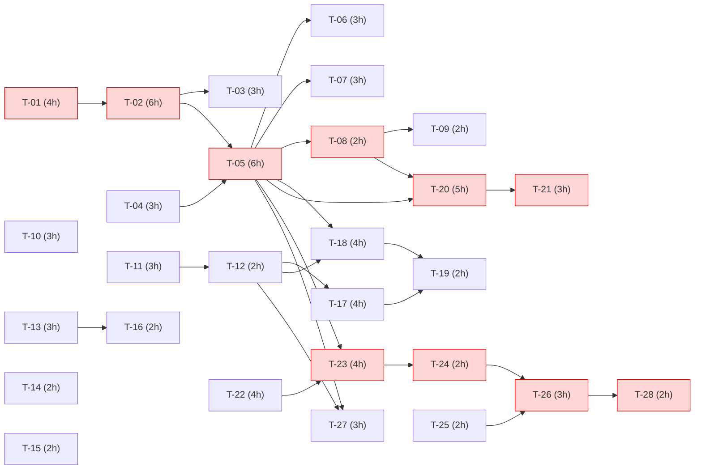

# 5. Sprint Atual · Sprint 3 (03/08/2026 – 27/09/2026)

**Meta da sprint:** entregar a lista padronizada de especificações validada com a Ford Ranger Raptor, o APK do app e a API protegida com pipeline DevSecOps.

**Compromisso:** 10 PBIs · 44 pontos · 28 tarefas · 87 horas

## PBIs da sprint

| PBI | Título | Pontos | Tarefas | Horas |
|---|---|---|---|---|
| PBI-18 | Normalizar unidades e formatos das especificações | 5 | T-01, T-02, T-03 | 13 |
| PBI-19 | Gerar lista de especificações em formato único (schema padronizado) | 8 | T-04, T-05, T-06, T-07 | 15 |
| PBI-20 | Explicitar 'Não disponível' quando a informação não existir | 2 | T-08, T-09 | 4 |
| PBI-21 | Hardening da API: rate limit, validação de entrada e padronização de erros | 3 | T-10, T-11, T-12 | 8 |
| PBI-22 | Pipeline DevSecOps (SAST, SCA, secret scanning e container scan) | 5 | T-13, T-14, T-15, T-16 | 9 |
| PBI-23 | Testes automatizados da API (sucesso, erro e acesso não autorizado) | 5 | T-17, T-18, T-19 | 10 |
| PBI-24 | Teste de aceitação automatizado com a Ford Ranger Raptor | 5 | T-20, T-21 | 8 |
| PBI-25 | Tela de resultado com a lista padronizada de especificações | 5 | T-22, T-23, T-24 | 10 |
| PBI-26 | Gerar build APK via Expo EAS Build | 3 | T-25, T-26 | 5 |
| PBI-27 | Documentação da API (OpenAPI/Swagger) e README de execução | 3 | T-27, T-28 | 5 |

## Tarefas

### PBI-18 · Normalizar unidades e formatos das especificações

| Tarefa | Descrição | Atividade | Esforço (h) | Dependências técnicas |
|---|---|---|---|---|
| T-01 | Criar tabela de conversão de unidades (kW→cv, Nm→kgfm, pol→mm) | Development | 4 | — |
| T-02 | Implementar serviço normalizador de valores e unidades | Development | 6 | T-01 |
| T-03 | Testes unitários do normalizador (casos de borda e unidades desconhecidas) | Testing | 3 | T-02 |

### PBI-19 · Gerar lista de especificações em formato único (schema padronizado)

| Tarefa | Descrição | Atividade | Esforço (h) | Dependências técnicas |
|---|---|---|---|---|
| T-04 | Definir schema JSON v1 da lista de especificações | Design | 3 | — |
| T-05 | Implementar endpoint GET /pesquisas/{id}/especificacoes | Development | 6 | T-04, T-02 |
| T-06 | Agrupar e ordenar atributos por categoria do catálogo | Development | 3 | T-05 |
| T-07 | Teste de contrato do schema v1 no pipeline | Testing | 3 | T-05 |

### PBI-20 · Explicitar 'Não disponível' quando a informação não existir

| Tarefa | Descrição | Atividade | Esforço (h) | Dependências técnicas |
|---|---|---|---|---|
| T-08 | Regra de preenchimento 'Não disponível' com motivo | Development | 2 | T-05 |
| T-09 | Testes de atributos inexistentes e texto livre não reconhecido | Testing | 2 | T-08 |

### PBI-21 · Hardening da API: rate limit, validação de entrada e padronização de erros

| Tarefa | Descrição | Atividade | Esforço (h) | Dependências técnicas |
|---|---|---|---|---|
| T-10 | Implementar rate limit por usuário/IP (60 req/min) | Development | 3 | — |
| T-11 | Validação e sanitização de entrada em todos os DTOs | Development | 3 | — |
| T-12 | Padronizar respostas de erro (RFC 7807 Problem Details) | Development | 2 | T-11 |

### PBI-22 · Pipeline DevSecOps (SAST, SCA, secret scanning e container scan)

| Tarefa | Descrição | Atividade | Esforço (h) | Dependências técnicas |
|---|---|---|---|---|
| T-13 | Adicionar SAST (Semgrep/SonarCloud) ao pipeline | Deployment | 3 | — |
| T-14 | Habilitar SCA (Dependabot/Snyk) nas dependências da API e do app | Deployment | 2 | — |
| T-15 | Adicionar secret scanning (Gitleaks) ao pipeline | Deployment | 2 | — |
| T-16 | Adicionar scan de imagem Docker (Trivy) | Deployment | 2 | T-13 |

### PBI-23 · Testes automatizados da API (sucesso, erro e acesso não autorizado)

| Tarefa | Descrição | Atividade | Esforço (h) | Dependências técnicas |
|---|---|---|---|---|
| T-17 | Testes de autenticação e perfis (401/403) | Testing | 4 | T-12 |
| T-18 | Testes de pesquisa: sucesso, 400 e 404 | Testing | 4 | T-05, T-12 |
| T-19 | Publicar relatório de testes e cobertura no pipeline | Deployment | 2 | T-17, T-18 |

### PBI-24 · Teste de aceitação automatizado com a Ford Ranger Raptor

| Tarefa | Descrição | Atividade | Esforço (h) | Dependências técnicas |
|---|---|---|---|---|
| T-20 | Automatizar cenário BDD da Ranger Raptor (Gherkin + step definitions) | Testing | 5 | T-05, T-08 |
| T-21 | Gerar relatório de aderência campo a campo vs. gabarito | Testing | 3 | T-20 |

### PBI-25 · Tela de resultado com a lista padronizada de especificações

| Tarefa | Descrição | Atividade | Esforço (h) | Dependências técnicas |
|---|---|---|---|---|
| T-22 | Layout da tela de resultado agrupada por categoria | Design | 4 | — |
| T-23 | Integrar tela de resultado ao endpoint de especificações | Development | 4 | T-05, T-22 |
| T-24 | Estados de carregando, vazio, erro e selo 'Não disponível' | Development | 2 | T-23 |

### PBI-26 · Gerar build APK via Expo EAS Build

| Tarefa | Descrição | Atividade | Esforço (h) | Dependências técnicas |
|---|---|---|---|---|
| T-25 | Configurar eas.json (perfil preview) e variáveis de ambiente | Deployment | 2 | — |
| T-26 | Gerar APK e testar instalação em dispositivo físico e emulador | Deployment | 3 | T-24, T-25 |

### PBI-27 · Documentação da API (OpenAPI/Swagger) e README de execução

| Tarefa | Descrição | Atividade | Esforço (h) | Dependências técnicas |
|---|---|---|---|---|
| T-27 | Documentar endpoints no OpenAPI/Swagger com exemplos | Documentation | 3 | T-05, T-12 |
| T-28 | Escrever README (execução, prints das telas, link do APK) | Documentation | 2 | T-26 |

## Esforço por atividade

| Atividade | Horas |
|---|---|
| Development | 35 |
| Testing | 24 |
| Deployment | 16 |
| Design | 7 |
| Documentation | 5 |

## Dependências entre tarefas

**Caminho crítico** (em vermelho):

- Validação da Ranger Raptor: T-01 → T-02 → T-05 → T-08 → T-20 → T-21
- APK: T-05 → T-23 → T-24 → T-26 → T-28

